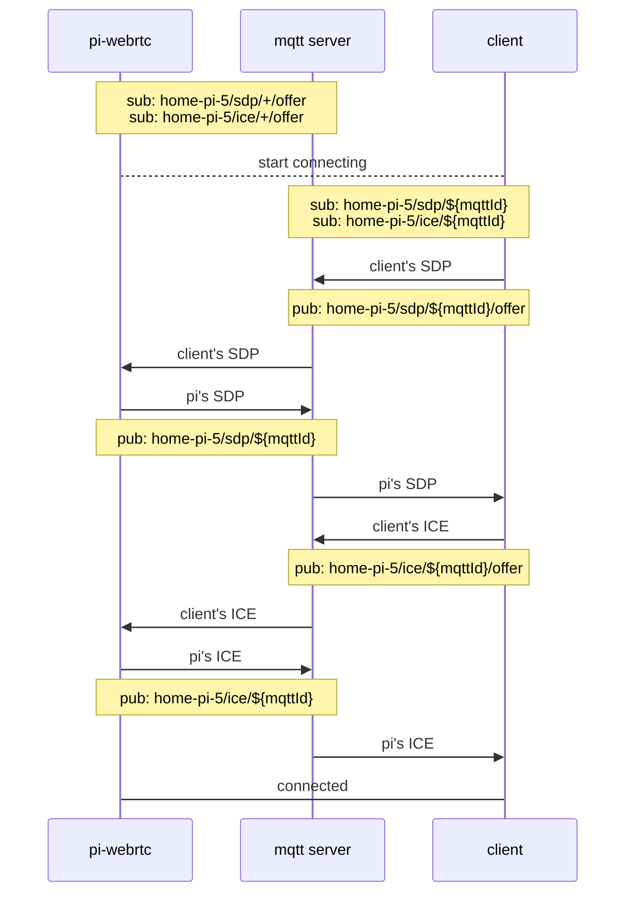
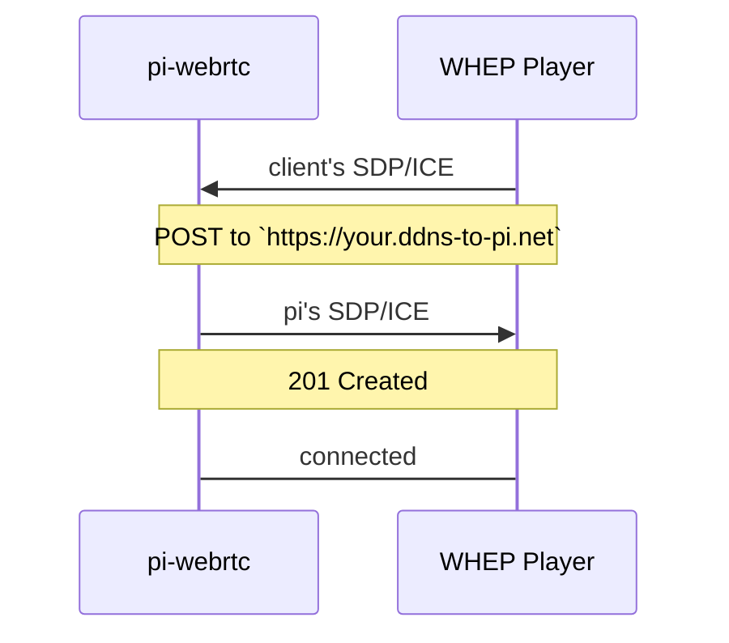

# Signaling

Before two WebRTC peers can send media they have to exchange an SDP offer/answer and a set of
ICE candidates. `pi-webrtc` can do that over three transports, and more than one can be
enabled at a time. If none is enabled the process exits — there would be no way to reach it.

| Transport | Needs | Good for |
|---|---|---|
| [MQTT](#mqtt) | An MQTT broker | Peer-to-peer viewing from anywhere, no public hostname |
| [WHEP](#whep) | A public hostname with TLS | Playing a URL in a standard WebRTC player |
| [WebSocket](#websocket) | An SFU server | Many simultaneous viewers |

All three are configured in [Configuration](CONFIGURATION.md#signaling).

## MQTT


`pi-webrtc` registers with the broker at startup and waits for a client to start the
handshake. Use [HiveMQ](https://www.hivemq.com), [EMQX](https://www.emqx.com/en), or a
[self-hosted broker](SETUP_MOSQUITTO.md).

```bash
/path/to/pi-webrtc --camera=libcamera:0 \
  --fps=30 \
  --width=1280 \
  --height=960 \
  --use-mqtt \
  --mqtt-host=your.mqtt.cloud \
  --mqtt-port=8883 \
  --mqtt-username=hakunamatata \
  --mqtt-password=Wonderful \
  --uid=home-pi-5 \
  --no-audio
```

Topics are namespaced by `--uid`. Below, `--uid=home-pi-5` and `${mqttId}` is a random id the
client generates to identify its own connection, so several clients can talk to one device at
once.



Clients:
[picamera.js](https://www.npmjs.com/package/picamera.js) ·
[picamera-react-native](https://www.npmjs.com/package/picamera-react-native) ·
[picamera-web](https://app.picamera.live) ·
[picamera-app](https://github.com/TzuHuanTai/picamera-app) (Android)

## WHEP


No broker and no registration — the client POSTs its SDP to a URL and gets one back, so the
stream plays from a plain URL much like RTSP or RTMP.

```bash
/path/to/pi-webrtc --camera=libcamera:0 \
  --fps=30 \
  --width=1280 \
  --height=960 \
  --use-whep \
  --http-port=8080 \
  --uid=home-pi-5 \
  --no-audio
```



Browsers only allow WebRTC from pages served over `https`, so in practice this needs a TLS
certificate in front of it — see [WHEP with an Nginx proxy](ADVANCED.md#whep-with-nginx-proxy).

Clients:
[Home Assistant WebRTC Camera](https://github.com/AlexxIT/WebRTC) (see
[the setup guide](ADVANCED.md#using-the-webrtc-camera-in-home-assistant)) ·
[eyevinn/webrtc-player](https://www.npmjs.com/package/@eyevinn/webrtc-player)

## WebSocket


MQTT and WHEP both give every viewer their own peer connection with the device, which the
device's uplink and encoder can only stretch so far. A **SFU** (Selective Forwarding Unit)
takes a single stream from the device and fans it out, so viewer count stops being the
device's problem. See [Broadcasting to 1,000+ viewers](ADVANCED.md#broadcasting-a-live-stream-to-1000-viewers-via-sfu)
for a worked example.

```bash
/path/to/pi-webrtc --camera=libcamera:0 \
    --fps=30 \
    --width=1920 \
    --height=1080 \
    --uid=your-display-name \
    --use-websocket \
    --use-tls \
    --ws-host=your-sfu-host.example.com \
    --ws-key=your-api-key \
    --ws-room=the-room-name
```

The device opens a WebSocket to `/rtc` on the SFU, passing `--ws-key`, `--ws-room`, and
`--uid` as the API key, room, and publisher identity. `--ws-port` defaults to `443` when
`--use-tls` is set and `80` otherwise. The SFU replies with the ICE servers to use, and the
usual offer/answer follows over that socket, including renegotiation when tracks change.

Everyone who joins the same room sees the stream. With `--enable-ipc`, DataChannel messages
are broadcast to every participant in the room rather than to a single peer.

Client: [picamera.js](https://github.com/TzuHuanTai/picamera.js?tab=readme-ov-file#watch-videos-via-the-sfu-server)

### Access Tokens <sup>[\*](COMMERCIAL.md#licensing)</sup>

The [commercial version](COMMERCIAL.md#licensing) connects to LiveKit directly and obtains
its own access tokens, either from a token service (`--token-url`) or by signing them
on-device from an API key/secret pair (`--ws-secret`), renewing them before they expire.

---

# Commercial Version

Options marked <sup>[\*](COMMERCIAL.md#licensing)</sup> above are part of the commercial
build. See [Commercial Version](COMMERCIAL.md) for what is included and how to license it,
or contact **tzu.huan.tai@gmail.com**.
